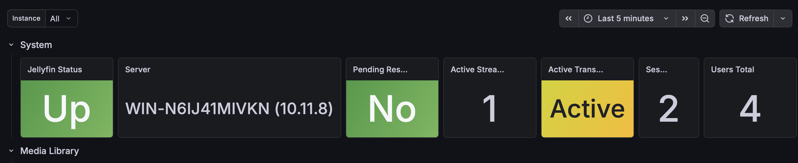
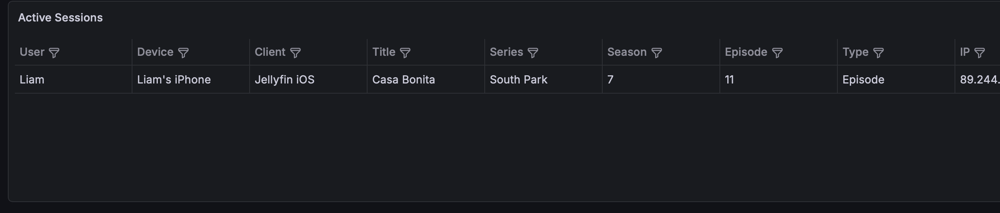
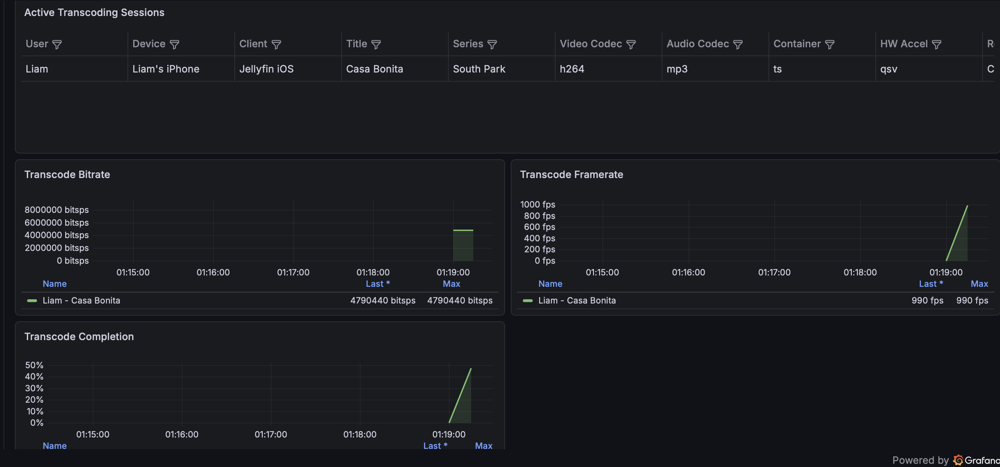
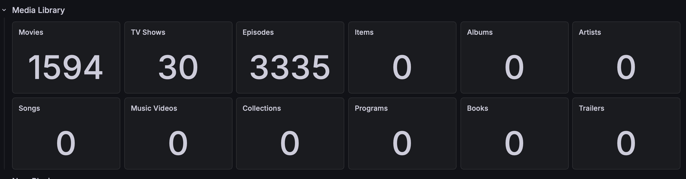

# Jellyfin Prometheus Exporter + Grafana Dashboard

A small Prometheus exporter for Jellyfin that reads data from the Jellyfin API and exposes it as Prometheus metrics.

This repository contains:

- `exporter.py` – the Jellyfin Prometheus exporter
- `compose.yml` – Docker / Portainer stack example
- `prometheus.yml` – Prometheus scrape job example
- `dashboard.json` – Grafana dashboard for this exporter

The included Grafana dashboard is designed for this exporter. It will not work correctly with Jellyfin's native `/metrics` endpoint alone and is not intended for unrelated Jellyfin exporters without changes.

---

## What this does

Jellyfin has a native Prometheus-compatible `/metrics` endpoint, but it mostly exposes application/runtime data such as .NET, ASP.NET, HTTP, process, and Kestrel metrics.

This exporter uses the Jellyfin API to expose media-server-focused metrics, for example:

- Jellyfin online/offline status
- Server name and version
- Pending restart status
- Active sessions
- Active streams
- Active transcodes
- Current playback information
- User/device/client information
- Transcode codec/container/hardware acceleration information
- Transcode bitrate, framerate, and completion percentage
- Media library counts
- User count
- User admin/disabled state
- Exporter scrape error metrics

---
## Screenshots

### Overview Dashboard



### Active Sessions



### Transcoding Monitoring



### Library Statistics



---

## Requirements

You need an already working setup with:

- Jellyfin
- Docker / Docker Compose / Portainer Stack Deploy
- Prometheus
- Grafana
- A Jellyfin API key

This project does not install Prometheus or Grafana for you.

---

## Repository files

```text
.
├── exporter.py
├── compose.yml
├── prometheus.yml
├── dashboard.json
└── README.md
```

---

## Create a Jellyfin API key

In Jellyfin:

```text
Dashboard
→ API Keys
→ Create new API key
```

Use a name such as:

```text
prometheus-exporter
```

Copy the generated key. You need it in the stack configuration.

---

## Deploy with Docker / Portainer Stack

The included `compose.yml` uses the official Python slim image, mounts `exporter.py`, installs the required Python packages, and starts the exporter.

Example:

```yaml
services:
  jellyfin-exporter:
    image: python:3.12-slim
    container_name: jellyfin-exporter
    restart: unless-stopped
    ports:
      - "9594:9594"
    volumes:
      - /opt/jellyfin-exporter/exporter.py:/app/exporter.py:ro
    environment:
      JELLYFIN_URL: "http://jellyfin.ip:8096"
      JELLYFIN_API_KEY: "YOUR_API_KEY_HERE"
    command: >
      sh -c "pip install flask requests prometheus-client &&
             python /app/exporter.py"
```

Before deploying, place the exporter on the Docker host:

```bash
mkdir -p /opt/jellyfin-exporter
cp exporter.py /opt/jellyfin-exporter/exporter.py
```

Then edit the stack values:

```yaml
environment:
  JELLYFIN_URL: "http://YOUR-JELLYFIN-IP:8096"
  JELLYFIN_API_KEY: "YOUR_JELLYFIN_API_KEY"
```

Example:

```yaml
environment:
  JELLYFIN_URL: "http://10.0.0.12:8096"
  JELLYFIN_API_KEY: "abc123..."
```

Deploy the stack.

---

## Verify the exporter

Open:

```text
http://YOUR-DOCKER-HOST:9594/metrics
```

You should see Prometheus metrics such as:

```prometheus
jellyfin_up 1
jellyfin_system_info{server_name="Jellyfin",version="..."} 1
jellyfin_pending_restart 0
jellyfin_sessions_total 1
jellyfin_streams_active 1
jellyfin_transcodes_active 0
jellyfin_users_total 4
jellyfin_media_count{type="MovieCount"} 1581
```

If `jellyfin_up` is `1`, the exporter can reach the Jellyfin API.

If `jellyfin_up` is `0`, check:

- Jellyfin URL
- API key
- Network connectivity between exporter and Jellyfin
- Jellyfin firewall / reverse proxy rules

---

## Prometheus configuration

Add the included scrape job to your `prometheus.yml`:

```yaml
- job_name: "jellyfin-exporter"
  static_configs:
    - targets:
        - "IP-OF-YOUR-DOCKER-CT:9594"
```

Replace the target with the IP or DNS name of the Docker host running the exporter.

Example:

```yaml
- job_name: "jellyfin-exporter"
  static_configs:
    - targets:
        - "10.0.0.100:9594"
```

Restart or reload Prometheus.

Example with Docker:

```bash
docker restart prometheus
```

Then open Prometheus:

```text
Status → Targets
```

The `jellyfin-exporter` target should be `UP`.

---

## Test in Prometheus

Try these PromQL queries:

```promql
jellyfin_up
```

```promql
jellyfin_streams_active
```

```promql
jellyfin_transcodes_active
```

```promql
jellyfin_media_count
```

```promql
jellyfin_session_active
```

If Prometheus returns values, the exporter is working correctly.

---

## Grafana dashboard

Import `dashboard.json` into Grafana:

```text
Grafana
→ Dashboards
→ New
→ Import
→ Upload dashboard.json
→ Select Prometheus data source
→ Import
```

The dashboard should populate automatically when Prometheus receives metrics from the exporter.

Recommended dashboard refresh interval:

```text
10s - 30s
```

---

## Exported metrics

### System

```prometheus
jellyfin_up
jellyfin_system_info
jellyfin_pending_restart
```

### Sessions

```prometheus
jellyfin_sessions_total
jellyfin_streams_active
jellyfin_session_active
jellyfin_session_paused
```

Labels include:

```text
session_id
username
client
device
remote_endpoint
title
type
series
season
episode
```

### Transcoding

```prometheus
jellyfin_transcodes_active
jellyfin_transcode_active
jellyfin_transcode_bitrate
jellyfin_transcode_framerate
jellyfin_transcode_completion_percentage
```

Labels include:

```text
video_codec
audio_codec
container
hardware_acceleration
transcode_reasons
```

### Library

```prometheus
jellyfin_media_count
```

The `type` label depends on Jellyfin's `/Items/Counts` API response, for example:

```text
MovieCount
SeriesCount
EpisodeCount
SongCount
AlbumCount
ArtistCount
```

### Users

```prometheus
jellyfin_users_total
jellyfin_user_disabled
jellyfin_user_admin
```

Labels include:

```text
username
user_id
```

### Scrape errors

```prometheus
jellyfin_sessions_scrape_error
jellyfin_counts_scrape_error
jellyfin_users_scrape_error
```

These indicate that a specific API section could not be scraped.

---

## Security notes

Do not publish your Jellyfin API key.

Recommended:

- Keep the exporter only reachable inside your LAN or Docker network.
- Do not expose port `9594` publicly.
- Let Prometheus scrape the exporter internally.
- Use firewall rules or reverse proxy access controls if needed.

The exporter only needs access to the Jellyfin API.

---

## Troubleshooting

### Exporter starts but `jellyfin_up` is `0`

Check:

```bash
docker logs jellyfin-exporter
```

Common causes:

- Wrong `JELLYFIN_URL`
- Wrong API key
- Jellyfin not reachable from Docker host
- Firewall or VLAN routing issue

### Prometheus target is DOWN

Check whether the exporter is reachable from the Prometheus host:

```bash
curl http://YOUR-DOCKER-HOST:9594/metrics
```

If this works, check the Prometheus target address.

### Grafana shows no data

Check Prometheus first:

```promql
jellyfin_up
```

If Prometheus has data but Grafana does not:

- Check selected Prometheus datasource
- Refresh dashboard variables
- Make sure you imported the dashboard made for this exporter

### Active streams show 0

That is normal when nobody is actively playing media.

Start playback in Jellyfin and refresh the dashboard.

### Transcodes show 0

That usually means the stream is Direct Play / Direct Stream.

Start playback on a client that requires transcoding to test this.

---

## Credits

The Grafana dashboard was originally based on:

```text
https://github.com/rebelcore/jellyfin_grafana
```

It was modified and redesigned to work with this exporter.

---

## License

Apache License 2.0

---

## Disclaimer

This project is not affiliated with Jellyfin.

Jellyfin is a trademark of the Jellyfin project.

---

Built during a completely unplanned homelab rabbit hole.
